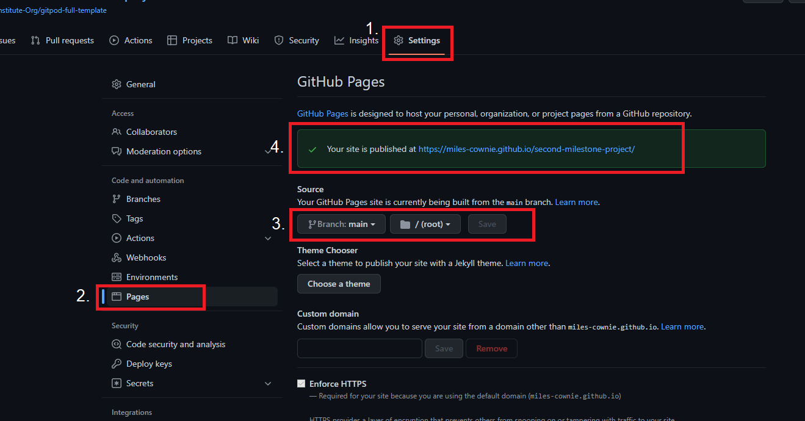

# History Quiz of the World

This web based application is designed to be a fun and engaging history quiz. It is targeted at students and recreational historians to test their general knowledge on the history of the world.

[Deployed Site](https://miles-cownie.github.io/second-milestone-project/)

# Contents

* [**User Experience**](<#user-experience>)
  * [Wireframes](<#wireframes>)
  * [Site Structure](<#site-structure>)
  * [Design Choices](<#design-choices>)
    * [Fonts](<#fonts>)
    * [Colour](<#colour>)

* [**Existing Features**](<#existing-features>)

* [**Desired Features**](<#desired-features>)

* [**Technologies Used**](<#technologies-used>)

* [**Testing**](<#testing>)
  * [Code Validation](<#code-validation>)
  * [Responsive Design Check](<#responsive-design-check>)
  * [Browser Compatibility](<#browser-compatibility>)
  * [Known Bugs](<#known-bugs>)
    * [Resolved](<#resolved>)
    * [Unresolved](<#unresolved>)
  * [Lighthouse](<#lighthouse>)

* [**Deployment**](<#deployment>)
  * [To deploy the project](<#to-deploy-the-project>)
  * [To fork the repository](<#to-fork-the-repository>)
  * [To create a local clone](<#to-create-a-local-clone>)

* [**Credits**](<#credits>)
  * [Content](<#content>)
  * [Media](<#media>)

# User Experience

## Wireframes

Wireframes for History Quiz of the World were built using [Balsamiq](https://balsamiq.com). The design proposed a responsive title bar and main quiz container with three buttons. The buttons and titel bar were initially wireframed to stack on mobile screens. The quiz page of the application had an additional progress bar to track user progress through the quiz. A third page was wireframed to be the awards page for the user, where they would see thier score and be presented with options to try other difficulties of the quiz.

[Back to top](<#contents>)

## Site Structure

The website consists of four pages. The first page is the index page and contains links to the other three pages. The user is prompted to choose a difficulty through one of the links displayed in the main quiz container. The other pages each correspond to a difficulty the user can select. All pages have audio controls and a home navigation link in the heading. A footer with (dummy) social media links is also present.

[Back to top](<#contents>)

## Design Choices

* ### Fonts
The font selected for this web application is Radio Canada to provide an open and friendly font for the user. This will fall back to sans serif if Radio Canada fails to load.

[Back to top](<#contents>)

* ### Colour

The colour scheme used for the website is rgba(73, 75, 35, 0.9) (Olive Green) as a background, with #ff9e01 (Warm Yellow) as text to provide a warm display while maintaining contrast. A secondary background colour of #ff9e01 (Orange) highlights the quiz play area from the rest of the background. Borders are coloured with #79081c (Burgandy) to make clear divsions between containers for the user.
The scheme was adopted from Color My Soul from [Pinterest](https://www.pinterest.co.uk/pin/308848486943717128/) to provide a consistent theme and clear contrast.

[Back to top](<#contents>)

# Existing Features

## Audio Controls

The audio controls at the top of the screen allow the user to control background music and sounds when the user clicks on buttons. The controls use a slider to indicate the ON and OFF state. The user's choices are also stored in the Session Storage API so the user doesn't have to re-select their choices between pages.

## Home Page and Difficulty Selection

The user starts at the home page and may select their desired difficulty from three colour-coded options. The text content area of the quiz contains instructions for the user on this page.

## Quiz Pages

After selecting their prefered difficulty, the user is presented with the first of 10 questions. These questions are in random order from a roster of 30 available questions. The quiz roster randomises whenever the page loads so a new order of questions is available each time the user plays the quiz.
The user selects their answer from the multiple choice options presented with the question. Once the user selects an answer, a message replaces the question informing the user whether they got the question correct or not, and provides the correct answer in both occasions. The button the user selected will also change colour to reinforce whether the user selected the correct answer. Following a timeout of 3 seconds, to provide the user time to read the answer message, the next question will display.

## Results Page

Once the user has answered the maximum number of questions (currently 10 questions) the question and answer text is replaced with the user's score and a prompt to try again. The option buttons are replaced with a single "Try Again" button.

## Progress Bar

Throughout the quiz, a bar at the bottom of the window tracks the user's progress. The progress bar is built to display a percentage of how far the user has made it through the quiz and is responsive to provide an accurate progress regardless of the maximum number of questions the user needs to answer.
The progress bar is complemented by a text indicator that also tracks user progress to be accessable for users who prefer an alternative means of tracking progress.

[Back to top](<#contents>)

# Desired Features

- Additonal background music to provide a less repetative user experience
- Different sounds for correct and incorrect answers
- More questions to make each generated quiz more unique from each other

[Back to top](<#contents>)

# Technologies Used

* [HTML5](https://html.com/html5/) - Provides content structure to the site.
* [CSS](https://www.w3.org/Style/CSS/Overview.en.html) - Adds style and responsive design to the site.
* [JavaScript](https://www.javascript.com) - Adds interactivity to the website.
* [Balsamiq](https://balsamiq.com/wireframes/) - Design and build wireframes for the site.
* [Github](https://github.com) - Acts as a repository for the site's code.
* [Gitpod](https://www.gitpod.io) - Builds and edits the code for the site.
* [GIMP](https://www.gimp.org) - Image editing software to create custom favicon

[Back to top](<#contents>)

# Testing

## Code Validation

All code for History Quiz of the World was run throught the W3C HTML validation, W3C CSS Validator, and the JSHint code quality tool. Initial errors were found, removed, and corrected. The validators reported no issues following that. JSHint provided some warnings following correction. However, these were all notifying the use of ES6 and were not considered detrimental to the running of the web application

[Back to top](<#contents>)

* Home Page:

* Quiz Pages:

The CSS validator results are below:

A section of the JSHint results are below:

[Back to top](<#contents>)

## Responsive Design Check

* The responsive design test was carried out successfully on all pages using [Responsive Design Checker](https://responsivedesignchecker.com). The responsive design rules acted correctly as designed across the below screen sizes. Content moved to the intended positions as expected and navigation links worked as intended.

- Display >1200px = Pass
- Display <1200px = Pass
- Ipad pro (1366x1024px) = Pass
- Ipad air (768x1024px) = Pass
- Iphone plus (414x736px) = Pass
- Sony Xperia (360x640px) = Pass
- Iphone (320x480px) = Pass
- Nest Hub Max (1280x800px) = Pass

[Back to top](<#contents>)

## Browser Compatibility

History Quiz of the World was tested on the following browsers with no issues to the user. Opera, Google Chrome, Mozilla Firefox, and Microsoft Edge. Apprearance, responsiveness, and functionality were consistent accross the browsers and different screen sizes.

[Back to top](<#contents>)

## Known Bugs

* ### Resolved

  * Javascript code suffered total failure during development and required total restart. Custom code was generating errors in all configurations and use of a [tutorial](https://www.youtube.com/watch?v=f4fB9Xg2JEY) corrected problems but required full restart. Future code was correctly commented to avoid requiring total restart again.
  * Screen failed to fill window on most desktop sizes and quiz containers moved out of background space at smaller sizes. Adjusted how screen was displayed in CSS and added additional media queries to fit content better to the screen.
  * Buttons would leave containers on mobile sized screens. Adjusted media queries to keep buttons within containers.
  * Unable to reach home screen from quiz pages. Added home navigation link to allow better movement between web pages.
  * Audio files failed to load correctly and would not play as expected. Deleted files and reloaded new ones to remove corrupted data.
  * Horizontal tablets display the quiz container too small for the content. Corrected with changes to media queries
  * Quiz-hard.html was incorrectly named so navigation failed at user selection. Corrected when typo was dealt with.
  * Javascript would attempt to play audio without user input and desynchronise from slider displays on page. Corrected by changine API from sessionStorage to localStorage.
  * The Favicon icon failed to load on pages outside of dev environment. HTML was adjusted to fix the issue.

[Back to top](<#contents>)

## Lighthouse

History Quiz of the World was tested using the [Lighthouse](https://developers.google.com/web/tools/lighthouse) dev tool program to test the pages for:
* Performance - How the pages run whilst loading.
* Accessibility - Checking how the site is accessible for users.
* Best Practices - Making sure the site fits with industry best practices.
* Seo - Search engine optimisation. Does the site run well with search engine results?

As an example, the results for the Home Page are as follows:

[Back to top](<#contents>)

## Deployment

### **To deploy the project**
This site was deployed using the Github Pages platform. To deploy a site with Pages one must:
 1. In Github's repository, navigate to the **Settings** tab.
 2. Once in the Settings, move to the **Pages** tab in the left-hand navigation column.
 3. Under the **Branch** selector, select the **main** option and the **root** folder, then click **save**.
 4. The site will automatically deploy and a green complete banner will indicate success.

 

### **To fork the repository**
 A copy of the page can be done through forking the Github account. This copy can be viewed and changed without modifying the original. To fork the repository one must:
  1. Log in to **GitHub** and locate the [repository](https://github.com/Miles-Cownie/second-milestone-project)
  2. Select the **fork** option in the top right hand corner of the page to create a copy of the repository.

  

### **To create a local clone**

  1. Select the **code** tab from the repository's navigation bar.
  2. Choose the **clone** option in the secondary navigation bar and copy the url provided.
  3. In your IDE of your choice open **Git Bash**
  4. Change the current working directory to the location where you want the cloned directory to be made.
  5. Type **git clone**, and then paste the URL copied from GitHub.
  6. Confirm the choice and the local clone will be created.

  

  [Back to top](<#contents>)

# Credits

### Content

- The icons were used through [Font Awesome](https://fontawesome.com).
- The fonts were used through [Google Fonts](fonts.google.com/specimen/Radio+Canada).
- The favicon image was developed from [DLPNG](https://dlpng.com/png/7029227), edited using [GIMP](https://www.gimp.org), and converted to the correct file type using [Favicon](https://favicon.io).
- The toggle switch was designed using the [W3schools Tutorial](https://www.w3schools.com/howto/howto_css_switch.asp).
- The progress bar was initial designed from the [W3schools Tutorial](https://www.w3schools.com/w3css/w3css_progressbar.asp).
- The initial javascript quiz code was sourced from Brian Design on [YouTube](https://www.youtube.com/watch?v=f4fB9Xg2JEY).

[Back to top](<#contents>)

### Media

- The colour scheme was used from Color My Soul on [Pinterest](https://www.pinterest.co.uk/pin/308848486943717128/).
- The background music used came courtesy of [Shane Ivers](https://www.silvermansound.com/free-music/tape-star) on Silverman Sound Studios.
- The answer sound was used from [Myinstants](https://www.myinstants.com/en/instant/skull-trumpet/).
- The desktop background images was sourced from Jimmy Tech on [Pexels](https://www.pexels.com/photo/ancient-greek-temple-951531/).
- The mobile background image was sourced from Andrea Piacquadio on [Pexels](https://www.pexels.com/photo/astronomical-clock-in-prague-820735/).

[Back to top](<#contents>)

# Acknowledgements
The site was completed as Portfolio Project 2 for the Diploma in Software Development (E-commerce Applications) with the [Code Institute](https://codeinstitute.net). I would like to thank my mentor [Precious Ijege](https://www.linkedin.com/in/precious-ijege-908a00168/), the Slack community, and all at the Code Institute for their help and support. Thank you to my friends and family who helped me test the site.

Miles Cownie 2022.

[Back to top](<#contents>)
