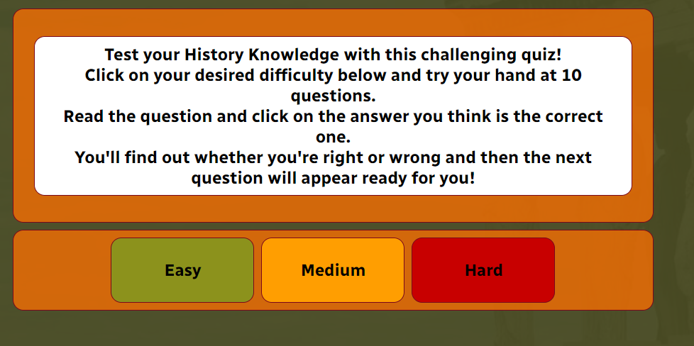

# History Quiz of the World

This web based application is designed to be a fun and engaging history quiz. It is targeted at students and recreational historians to test their general knowledge on the history of the world.

[Deployed Site](https://miles-cownie.github.io/second-milestone-project/)

# Contents

* [**User Experience**](<#user-experience>)
  * [Wireframes](<#wireframes>)
  * [Site Structure](<#site-structure>)
  * [Design Choices](<#design-choices>)
    * [Fonts](<#fonts>)
    * [Colour](<#colour>)

* [**Existing Features**](<#existing-features>)
  *

* [**Desired Features**](<#desired-features>)

* [**Technologies Used**](<#technologies-used>)

* [**Testing**](<#testing>)
  * [Code Validation](<#code-validation>)
  * [Responsive Design Check](<#responsive-design-check>)
  * [Browser Compatibility](<#browser-compatibility>)
  * [Known Bugs](<#known-bugs>)
    * [Resolved](<#resolved>)
    * [Unresolved](<#unresolved>)
  * [Lighthouse](<#lighthouse>)

* [**Deployment**](<#deployment>)
  * [To deploy the project](<#to-deploy-the-project>)
  * [To fork the repository](<#to-fork-the-repository>)
  * [To create a local clone](<#to-create-a-local-clone>)

* [**Credits**](<#credits>)
  * [Content](<#content>)
  * [Media](<#media>)

# User Experience

## Wireframes

Wireframes for History Quiz of the World were built using [Balsamiq](https://balsamiq.com). The design proposed a responsive title bar and main quiz container with three buttons. The buttons and titel bar were initially wireframed to stack on mobile screens. The quiz page of the application had an additional progress bar to track user progress through the quiz. A third page was wireframed to be the awards page for the user, where they would see thier score and be presented with options to try other difficulties of the quiz.

[Back to top](<#contents>)

## Site Structure

The website consists of four pages. The first page is the index page and contains links to the other three pages. The user is prompted to choose a difficulty through one of the links displayed in the main quiz container. The other pages each correspond to a difficulty the user can select. All pages have audio controls and a home navigation link in the heading. A footer with (dummy) social media links is also present.

[Back to top](<#contents>)

## Design Choices

* ### Fonts
The font selected for this web application is Radio Canada to provide an open and friendly font for the user. This will fall back to sans serif if Radio Canada fails to load.

[Back to top](<#contents>)

* ### Colour

The colour scheme used for the website is rgba(73, 75, 35, 0.9) (Olive Green) as a background, with #ff9e01 (Warm Yellow) as text to provide a warm display while maintaining contrast. A secondary background colour of #ff9e01 (Orange) highlights the quiz play area from the rest of the background. Borders are coloured with #79081c (Burgandy) to make clear divsions between containers for the user.
The scheme was adopted from Color My Soul from [Pinterest](https://www.pinterest.co.uk/pin/308848486943717128/) to provide a consistent theme and clear contrast.

[Back to top](<#contents>)

# Existing Features

## Audio Controls

The audio controls at the top of the screen allow the user to control background music and sounds when the user clicks on buttons. The controls use a slider to indicate the ON and OFF state. The user's choices are also stored in the Session Storage API so the user doesn't have to re-select their choices between pages.

## Home Page and Difficulty Selection

The user starts at the home page and may select their desired difficulty from three colour-coded options. The text content area of the quiz contains instructions for the user on this page.

[Back to top](<#contents>)

# Desired Features

- 

[Back to top](<#contents>)

# Technologies Used

* [HTML5](https://html.com/html5/) - Provides content structure to the site.
* [CSS](https://www.w3.org/Style/CSS/Overview.en.html) - Adds style and responsive design to the site.
* [JavaScript]() - Adds interactivity to the website.
* [Balsamiq](https://balsamiq.com/wireframes/) - Design and build wireframes for the site.
* [Github](https://github.com) - Acts as a repository for the site's code.
* [Gitpod](https://www.gitpod.io) - Builds and edits the code for the site.

[Back to top](<#contents>)

# Testing

## Code Validation

[Back to top](<#contents>)

* 

The CSS validator results are below:

The JS validator results are below:

[Back to top](<#contents>)

## Responsive Design Check

* 

[Back to top](<#contents>)

## Browser Compatibility

[Back to top](<#contents>)

## Known Bugs
* ### Resolved

  *

* ### Unresolved

  *

[Back to top](<#contents>)

## Lighthouse

 was tested using the [Lighthouse](https://developers.google.com/web/tools/lighthouse) dev tool program to test the pages for:
* Performance - How the pages run whilst loading.
* Accessibility - Checking how the site is accessible for users.
* Best Practices - Making sure the site fits with industry best practices.
* Seo - Search engine optimisation. Does the site run well with search engine results?

As an example, the results for the Home Page are as follows:

[Back to top](<#contents>)

## Deployment

### **To deploy the project**
This site was deployed using the Github Pages platform. To deploy a site with Pages one must:
 1. In Github's repository, navigate to the **Settings** tab.
 2. Once in the Settings, move to the **Pages** tab in the left-hand navigation column.
 3. Under the **Branch** selector, select the **main** option and the **root** folder, then click **save**.
 4. The site will automatically deploy and a green complete banner will indicate success.

 

### **To fork the repository**
 A copy of the page can be done through forking the Github account. This copy can be viewed and changed without modifying the original. To fork the repository one must:
  1. Log in to **GitHub** and locate the [repository](https://github.com/Miles-Cownie/first-milestone-project)
  2. Select the **fork** option in the top right hand corner of the page to create a copy of the repository.

  

### **To create a local clone**

  1. Select the **code** tab from the repository's navigation bar.
  2. Choose the **clone** option in the secondary navigation bar and copy the url provided.
  3. In your IDE of your choice open **Git Bash**
  4. Change the current working directory to the location where you want the cloned directory to be made.
  5. Type **git clone**, and then paste the URL copied from GitHub.
  6. Confirm the choice and the local clone will be created.

  

  [Back to top](<#contents>)

# Credits

### Content

[Back to top](<#contents>)

### Media

[Back to top](<#contents>)

# Acknowledgements
The site was completed as Portfolio Project 2 for the Diploma in Software Development (E-commerce Applications) with the [Code Institute](https://codeinstitute.net). I would like to thank my mentor [Precious Ijege](https://www.linkedin.com/in/precious-ijege-908a00168/), the Slack community, and all at the Code Institute for their help and support. Thank you to my friends and family who helped me test the site.

Miles Cownie 2022.

[Back to top](<#contents>)
